# Hi there, I'm Phil  🤙 

## I'm a Software Architect from Germany

- 💻 I’m currently working on: ... [Jihub](https://github.com/phil91/jihub) as Project Maintainer, [Catena-X Portal](https://github.com/eclipse-tractusx/portal-backend) as Commiter and some private (hopefully soon to be public) projects
- 🥅 Goals: ... contribute to more open source projects, learn 🦀 Rust

### Connect with me

&nbsp;&nbsp;

&nbsp;&nbsp;

---

<table>
  <tr>
    <td ccolspan="2">
      
    </td>
    <td>
      
    </td>
  </tr>
</table>

  
🏆 GitHub Stats

  

    <section>
      <table>
        <tr>
          <td>
             
             
            
          </td>
          <td>
            <em>🏃 Recent Activity</em> 
             
            
          </td>
        </tr>
        <tr>
          <td colspan="2" align="right">
            
            Profile Analysis & Language Activity. Generated with <a href="https://github.com/lowlighter/metrics">lowlighter/metrics</a>
            
          </td>
        </tr>
      </table>
    </section>
  

<footer></footer>

[website]: https://www.digitalnativesolutions.de
[linkedin]: https://de.linkedin.com/in/phils91
[xing]: https://www.xing.com/profile/Philip_Schneider14
