# Hi there, I'm Phil 🤙

## I'm a Software Architect from Germany

- 💻 I’m currently working on: ... private (hopefully soon to be public) projects
- 🥅 2022 Goals: ... learn more about 🦀 Rust, web3, Svelte and Nuxt / Next
- 📚 I’m currently learning: ... everything 🤣
- ⚡ Fun fact: ... I love to surf 🏄‍♂️ and everything marvel related

### Connect with me

  

  

---

<table>
  <tr>
    <td colspan="2" align="center">
      </img>
      
    </td>
  </tr>
</table>

  
🆠GitHub Stats

  

    <section>
      
      &nbsp; &nbsp;
      
    </section>
    
&nbsp;

    <section>
      <table>
        <tr>
          <td colspan="2" align="center">
             
             
            
          </td>
          <!-- <td>
            <em>Default Analysis - Profile Repositories</em> 
             
             
            <em>Indepth Analysis - Public Commits (Category: "Programming")</em> 
             
             
            <em>Default Analysis - Recent Commits (30 Days)</em> 
             
            
          </td> -->
        </tr>
        <tr>
          <td colspan="2" align="right">
            
            Profile Analysis & Language Activity. Generated with <a href="https://github.com/lowlighter/metrics">lowlighter/metrics</a>
            
          </td>
        </tr>
      </table>
    </section>
    <footer></footer>
  

[website]: https://www.digitalnativesolutions.de
[linkedin]: https://de.linkedin.com/in/phils91
[xing]: https://www.xing.com/profile/Philip_Schneider14
[ms]: https://docs.microsoft.com/de-de/aspnet/core/?view=aspnetcore-6.0
[sass]: https://sass-lang.com/
[tailwind]: https://tailwindcss.com/
[react]: https://reactjs.org/
[rider]: https://www.jetbrains.com/rider/
[docker]: https://www.docker.com/
[postgresql]: https://www.postgresql.org/
[serverless]: https://www.serverless.com/
[vscode]: https://code.visualstudio.com/
[gatsby]: https://www.gatsbyjs.com/
[graphql]: https://graphql.org/
[nodejs]: https://nodejs.org/
[github]: https://github.com/
[git]: https://git-scm.com/
[typescript]: https://www.typescriptlang.org/
[redis]: https://redis.io/
[azure]: https://azure.com/
